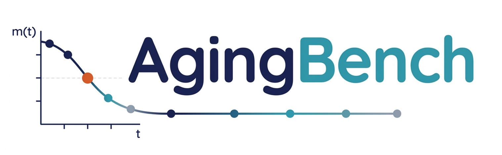

<div align="center">



<p>

[](https://agingbench.github.io/)
[](docs/CHANGELOG.md)
[](#agingcard)
[](#install)
[](LICENSE)

> **A longitudinal reliability benchmark that explores four aging mechanisms in memory-enabled AI agents.** <br>
> 8 scenarios | 4 aging mechanisms | AgingCard v1.0.0 | Compression · Interference · Revision · Maintenance.

</div>

---

The reliability of any long-running system degrades over time: databases accumulate stale indices, software accrues technical debt, and human memory fades with age. Memory-enabled agents are no exception. Even with frozen weights, their system state continues to change as they accumulate context across sessions, and their ability to store, retrieve, and apply knowledge deteriorates in ways that standard snapshot evaluation cannot capture.

AgingBench is a longitudinal reliability benchmark suite organized around four aging mechanisms: compression, interference, revision, and maintenance, supporting various scenarios, models, memory policies and agent frameworks, ranging from a fully controlled runner to practical autonomous agents (e.g., Claude Code). 

We are committed to actively maintaining this repository as a resource for evaluating the longitudinal reliability of AI agents, and we welcome contributions and suggestions from the community.

## 📢 Updates

* **v0.3.0** — Initial public release (2026-05-13). Eight scenarios (S1–S8) across the four aging mechanisms, AgingCard schema v1.0.0, `agingbench` + `agingbench-lite` CLIs in a single `pip install`, telemetry-mode post-hoc trace analysis. Full log will be updated in [docs/CHANGELOG.md](docs/CHANGELOG.md).

---

## How it works

A single AgingBench run simulates an agent's operational lifetime in a controlled loop:

```
For each session t = 0, 1, 2, …, N:
  1. Agent reads its compressed memory M_t
  2. Agent receives tasks and answers them
  3. Benchmark scores the answers (keyword match / probe match)
  4. Session history H_t is folded into memory:
        M_{t+1} = compress(M_t + H_t)         ← information leaks here
Over time M_t loses facts → scores drop → AgingBench fits the aging curve.
```

**Key concepts**

- **Session** — one round of tasks + memory update. ≈ "one day" in the agent's life.
- **Memory policy** — how the agent stores / compresses its history. The headline policy is `summarize_store`, paired with one of the compaction prompts under [`prototype/experiments/prompts/`](prototype/experiments/prompts/) — `compact_lossy.txt` for the aggressive "lossy" style, `compact_medium.txt` for the higher-fidelity "careful" style. Baselines like `growing_history` (no compression) and `no_memory` (frozen) live alongside several other policies (episodic, chain-compress, typed-state, workspace, observer, …) in [`prototype/agingbench/core/memory/`](prototype/agingbench/core/memory/) — browse the folder for the full set.
- **Aging curve `m(t)`** — score vs. session. Half-life = sessions until 50% of capability is lost.
- **Memory is the independent variable** — same model with different policies produces different aging curves.

### Latest supporting scenarios

| ID | Name | Tier | Sessions | What it tests |
|----|------|:----:|:--------:|---------------|
| **S1** | Research Literature | T1 | 8–20 | Fact survival under compression |
| **S2** | Lifestyle Assistant | T1 | 8–10 | Constraint adherence + revision (forget, accumulator) |
| **S3** | Knowledge Base | T1 | 8–12 | Decision fidelity under accumulation |
| **S4** | Software Engineering | T1 | 8–12 | Code planning with retractions |
| **S5** | Self-Planning Notebook | T1 | 8–20 | Agent manages its own workspace files |
| **S6** | Naturalistic | T1 | 10–15 | Multi-domain recall with corrections |
| **S7** | Research-Notes Coding Task | T2 | 10–20 | Production CLI (OpenHands / Claude Code) building a notes-app codebase |
| **S8** | SWE-bench-Aging *(newly added)* | T2 | 8 | Production CLI on a curated chain of real Django GitHub issues |

Tier 1 = benchmark-driven loop; Tier 2 = external agent driving its own loop, wrapped via an adapter. Per-scenario READMEs at [`prototype/agingbench/scenarios/sN_*/README.md`](prototype/agingbench/scenarios/) cover data design, scoring pipeline, and example invocations.

> **Want a new scenario?** S8 was added in v0.3.0 and we're actively welcoming further scenario contributions — production agent deployments, domain-specific failure modes, anything that exercises a memory-aging axis we haven't covered yet. See [docs/CONTRIBUTING.md#how-to-add-a-new-scenario](docs/CONTRIBUTING.md#how-to-add-a-new-scenario) for the protocol (scenario manifest → generator → runner → tests).

---

## Install

```bash
pip install "git+https://github.com/AgingBench/AgingBench.git@v0.3.0#subdirectory=prototype"
```

Registers the `agingbench` and `agingbench-lite` CLIs and bundles the prompt templates, profile YAMLs, and JSON schemas the runner needs at runtime.

> **Local clone alternative** (for development): `git clone https://github.com/AgingBench/AgingBench.git && cd AgingBench && uv sync --extra api --project prototype`.

API keys are required for any run that calls an API model (Anthropic / OpenAI / Gemini). Set `ANTHROPIC_API_KEY` / `OPENAI_API_KEY` / `GEMINI_API_KEY` / `HF_TOKEN` in your shell or in a `.env` at the repo root (auto-loaded by the CLI). Local-GPU SUTs (e.g. `qwen3_8b_lossy_compress.yaml`) need no API key.

> **Docker** is required only for **S8** (SWE-bench-Aging). Pre-pull the 8 images with the snippet in [`prototype/agingbench/scenarios/s8_swe_bench/README.md`](prototype/agingbench/scenarios/s8_swe_bench/README.md#docker-image-requirement). S1–S7 do not need Docker.

---

## Quick start

```bash
uv run --project prototype agingbench run \
  --scenario s6_naturalistic \
  --sut agingbench/registry/suts/qwen3_8b/qwen3_8b_lossy_compress.yaml \
  --sessions 10 --card
```

Runs the naturalistic multi-domain scenario for 10 sessions on **Qwen3-8B** locally (open weights, no API key). To run on an API model instead, swap the `--sut` to one under `agingbench/registry/suts/haiku45/` (needs `ANTHROPIC_API_KEY`) or `gpt4omini/` (needs `OPENAI_API_KEY`) — API runs are faster, billed at your provider's per-token rate.

Success looks like: `m0=… m_final=… half_life=… slope=…` printed at the end, plus `aging_curve.png` + `aging_card.json` written under `experiments/results/...`.

### Output files

Each run writes to `prototype/experiments/results/<scenario>/<sut_id>/`:

| File | Contents |
|---|---|
| `metrics.json` | `m0`, `m_final`, `half_life`, `decay_slope`, per-session `checkpoints` |
| `dependency_metrics.json` | DAG metrics: `chain_recall_by_depth`, `version_accuracy`, `interference_resistance` |
| `trace.jsonl` | OpenInference-style event log (every LLM call, tool call, probe) |
| `aging_curve.png` | Headline aging curve plot |
| `aging_card.json` | Consolidated cross-scenario card (v1.0.0 schema) — emitted with `--card` |

---

## Running experiments

```bash
# Lite — S1, S2, S7 × 3 seeds × Haiku-class. ~30 min, no Docker.
uv run --project prototype agingbench run --suite lite --seeds 3 --card

# Full — all 8 scenarios × default SUTs × 3 seeds. ~6 hr. S8 needs Docker.
uv run --project prototype agingbench run --suite full --seeds 3 --card

# Pressure sweep — S1+S2+S5 at light/medium/heavy PressureConfig presets.
uv run --project prototype agingbench run --suite pressure_sweep --seeds 3 --card
```

Override the default SUT for any suite with `--sut <yaml>` (browse [`prototype/agingbench/registry/suts/`](prototype/agingbench/registry/suts/)). Compare two run directories with `agingbench compare <run_a> <run_b>`. Product teams that want lite as a pre-deployment check on every PR can copy [`prototype/examples/ci/agingbench-lite-template.yml`](prototype/examples/ci/agingbench-lite-template.yml) into their own `.github/workflows/`.

---

## AgingCard

Every run with `--card` emits an `aging_card.json`. One card per (scenario × SUT × seed).

```bash
# Validate a card against the v1.0.0 JSON Schema
python -m agingbench.metrics.aging_card_validate \
  experiments/results/*/seed_*/aging_card.json
```

Schema: [`prototype/agingbench/metrics/aging_card_schema.json`](prototype/agingbench/metrics/aging_card_schema.json). Sample cards: [`prototype/examples/sample_cards/`](prototype/examples/sample_cards/). Submission process: [docs/LEADERBOARD.md](docs/LEADERBOARD.md).

---

## Telemetry mode (production traces)

Scenario mode runs constructed scenarios against your model. **Telemetry mode** is the inverse: feed it a JSONL trace from a deployed agent and it emits the same `AgingCard` schema — no probes, no gold answers, just per-mechanism inferences from what already happened. v0.3.0 verifies one production format end-to-end: **Claude Code session files** (`~/.claude/projects/<id>/*.jsonl`). The pipeline also accepts a generic JSONL shape (any custom log with `session_id` / `role` / `content` / token fields) for bring-your-own traces; adapters for OpenAI Assistants, OpenHands, Langfuse, LangSmith, and OpenTelemetry parse-test successfully but their extraction recipes against current third-party SDKs are not yet validated and will land in subsequent releases.

Telemetry mode is a Python library:

```python
from agingbench.telemetry import trace_to_card_v11

result = trace_to_card_v11(
    trace_jsonl="path/to/your_trace.jsonl",
    trace_format="claude_code",          # v0.3.0 verifies claude_code + generic; openai_assistants / openhands / langfuse / langsmith / otlp are parse-tested and will be validated in subsequent releases
    profile="code_assistant",            # or: generic
    extract_outcomes=["claude_session_flags", "record_patterns"],
    sut_hint={"sut_id": "prod_agent", "model_id": "claude-sonnet-4-5"},
)
print(result.card["headline"])           # same AgingCard fields as scenario runs
print(result.card["trace_audit"])        # per-mechanism trajectories + saturation-aware verdicts
```

Each of the four aging mechanisms emits a per-session trajectory **and** a `<metric>_verdict` field (`rising_degradation`, `floor_healthy`, etc.). Full pipeline (trace formats, deployment profiles, OutcomeEvent extractor specs, privacy scrubbing): [`prototype/agingbench/telemetry/README.md`](prototype/agingbench/telemetry/README.md).

For library use, set API keys as ordinary env vars (`os.environ["ANTHROPIC_API_KEY"] = …`) — the `.env` auto-loader documented above is CLI-only.

---

## Four aging mechanisms

1. **Compression** — write-before-query barrier destroys facts at compaction time
2. **Interference** — growing state buries relevant facts behind stale ones
3. **Revision** — system fails to track changing truth (latent state, selective forgetting)
4. **Maintenance** — operational events (recompaction, model swap) cause silent regression

AgingBench treats memory policy as the independent variable: same model, different policies produce different aging curves.

---

## Where to go next

| If you want to… | Read |
|---|---|
| Add a new model / memory policy / scenario / adapter | [docs/CONTRIBUTING.md](docs/CONTRIBUTING.md) |
| Submit an AgingCard to the public leaderboard | [docs/LEADERBOARD.md](docs/LEADERBOARD.md) |
| Use telemetry mode on production traces | [`prototype/agingbench/telemetry/README.md`](prototype/agingbench/telemetry/README.md) |
| See per-version release notes | [docs/CHANGELOG.md](docs/CHANGELOG.md) |

---

## Citation

If you find this work useful, please cite:

```bibtex
@inproceedings{agingbench2026,
  title     = {Long-Lived AI Agents Age Too: They Quietly Decay After Deployment},
  author    = {Zhu, Jianing and Ro, Yeonju and Robertson, John and Wang, Kevin and
               Li, Junbo and Vikalo, Haris and Akella, Aditya and Wang, Zhangyang},
  booktitle = {Preprint},
  year      = {2026}
}
```

---

## License

This project is released under the [MIT License](LICENSE).
